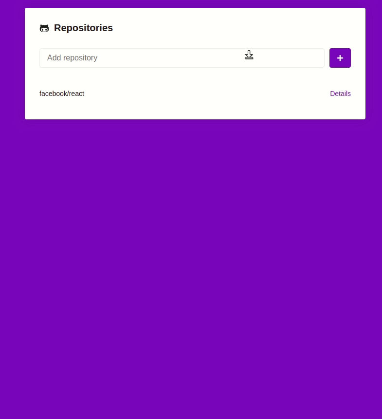

<h1 align="center">
	bootcamp-gostack-desafio05
</h1>

<h3 align="center">
  Challenge 5: Introduction to React
</h3>

<p align="center">
  
</p>

A simple React application that creates an interface and gets information from **GitHub Api**.

#### Application screen



## Technologies

- [NodeJS 10.16.3](https://nodejs.org/)
- [ReactJS 16.9.0](https://reactjs.org/)

## Run

```bash
# After clone the project
$ cd bootcamp-gostack-desafio05

# Install packages
$ yarn install
# or
$ npm install

# Run the app
$ yarn start
```

The application will be available at: _http://localhost:3000/_

---

This is part of my [GoStack](https://rocketseat.com.br/bootcamp) training
